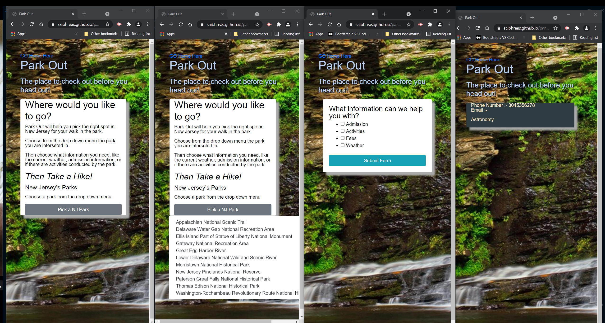

###
###
###
# PARK OUT
## Interactive Front-end Application

##use everything you’ve learned over the past six units to create a real-world front-end application that you’ll be able to showcase to potential employers. The user story and acceptance criteria will depend on the project that you create, but your project must fulfil the following requirements:

* Be deployed to GitHub Pages.

* Be interactive (i.e., accept and respond to user input).

* Use at least two [server-side APIs](https://coding-boot-camp.github.io/full-stack/apis/api-resources).

* Does not use alerts, confirms, or prompts (use modals).

* Use client-side storage to store persistent data.

* Be responsive.

* Have a polished UI.

* Have a clean repository that meets quality coding standards (file structure, naming conventions, follows best practices for class/id naming conventions, indentation, quality comments, etc.).

* Have a quality README (with unique name, description, technologies used, screenshot, and link to deployed application).

### User Story
As an outdoor enthusiast, before I go out to a new place for a hike, I want to be able to see the weather and park information without having to go to multiple sites so that I can plan my hike.

### Criteria  
  1. Used two API calls, National Parks Service, and Open Weather Map.  We also integrated Map quest for future expansion of app 
  2. Utilized client side local storage only.
  3. Application utilizes modal integration for user interface, no prompts or alerts.
  4. Application accepts and responds to user input.  

### API calls utilized:
  - https://openweathermap.org/api/one-call-api
  - https://www.nps.gov/subjects/developer/api-documentation.htm

https://github.com/saibhreas/parkout
 https://saibhreas.github.io/parkout/

 ## Now all you have to do is picke a park and take a hike!
